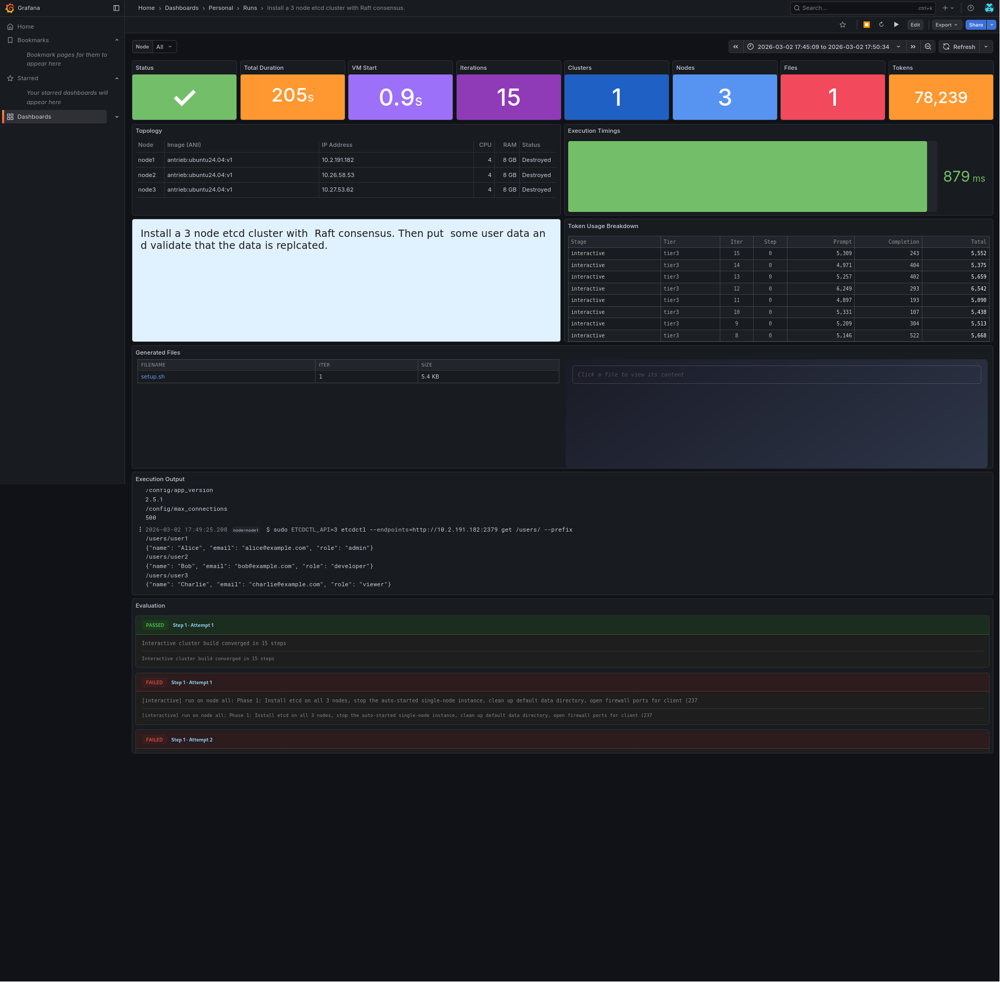

# Antrieb MCP Server

**An MCP server that gives you real, instant, and full virtual machines for validating infra code.** Tell Claude (or any MCP client) to deploy a Redis cluster, configure Nginx, or set up resources on AWS and Antrieb will spin up actual VMs, generate the code, run it, and self-correct until it works.

No containers. No sandboxes. Real VMs with full OS access, networking, and multi-node clusters.

Antrieb is a remote MCP server — nothing to install. Add it to your config and start deploying.

**Key objective: Make AI-Generated Infrastructure Converge.**

## Quick Start

Add this to your MCP client config (`mcp.json`, Claude Desktop settings, etc.):


```json
{
  "mcpServers": {
    "antrieb": {
      "url": "https://antrieb.sh/mcp"
    }
  }
}
```

OR

```json
{
  "mcpServers": {
    "antrieb": {
      "url": "https://antrieb.sh/mcp",
      "headers": {
        "Authorization": "Bearer ant_YOUR_API_KEY"
      }
    }
  }
}
```

That's it. No local install, no dependencies, no Docker.

You can try without an API key or get one by logging in at https://antrieb.sh/

> **Note:** Without an API key, your tasks will appear in the [community feed](https://antrieb.sh/d/antrieb-community-feed/).

## What It Does

You describe what you want in natural language. Antrieb spins up real VMs, generates the code, executes it, validates the result, and self-corrects if something fails, all in one call.

```
"Set up a Node.js Express hello world app with PM2 on 1 Ubuntu node"
"Create 2 t3.micro EC2 instances behind a Network Load Balancer using Terraform"
"Use Ansible to set up Prometheus and node_exporter on 3 nodes"
```

Every execution returns a live monitoring dashboard so you can watch it happen in real time.

## Tools

Antrieb exposes 5 MCP tools:

### `run`

Execute infrastructure automation on real VMs.

| Parameter | Type | Required | Description |
|-----------|------|----------|-------------|
| `prompt` | string | yes | What you want to build/deploy/configure |
| `cluster` | array | no | VM topology (e.g. `["ubuntu24.04 x3"]`, `["ansible-controller", "ubuntu24.04 x3"]`) |
| `language` | string | no | `bash`, `python`, `ansible`, `dockerfile`, `terraform-aws`, `cloudformation-aws` |
| `session_id` | string | no | Resume a previous session for iterative changes |
| `max_iterations` | number | no | Self-correction attempts (default: 12). Set to `0` to just execute the code you provide without any self-correction |

### `search`

Find available VM images and workspaces.

| Parameter | Type | Required | Description |
|-----------|------|----------|-------------|
| `keywords` | string | no | Search by name, description, or tags |

### `status`

Monitor a running job. Supports long-polling.

| Parameter | Type | Required | Description |
|-----------|------|----------|-------------|
| `job_id` | string | no | Job ID from a previous `run` |
| `timeout` | number | no | Long-poll timeout in ms |

### `files`

Download files from a completed session.

| Parameter | Type | Required | Description |
|-----------|------|----------|-------------|
| `session_id` | string | yes | Session ID |
| `filenames` | array | yes | Files to retrieve |

### `cancel`

Stop a running job and destroy its VMs.

| Parameter | Type | Required | Description |
|-----------|------|----------|-------------|
| `job_id` | string | yes | Job to cancel |

## Available Environments

### Base Images
- `ubuntu24.04` — Ubuntu 24.04 LTS
- `almalinux9` — AlmaLinux 9
- `archlinux` — Arch Linux
- `centos-stream10` — CentOS Stream 10
- `alpine` — Alpine Linux 3.23

### Pre-Built Images

Antrieb includes specialized images with pre-configured environments:

`helm-k3s`, `ansible-controller`, `terraform-aws`, `cloudformation-aws`, `podman-docker`

Use `search` to discover all available images, or just describe what you need — Antrieb will pick the right topology.

## How It Works

1. You call `run` with a natural language prompt
2. Antrieb provisions VMs; each VM in less than a second.
3. A specialist LLM generates the automation code
4. Code executes on the real VMs
5. If something fails, Antrieb reads the error, rewrites the code, and retries
6. You get back the result, generated files, and a monitoring dashboard

Typical end-to-end for a 3-node cluster: **under 2 seconds** for VM provisioning, plus LLM and execution time.

## Monitoring



Every `run` returns a `telemetry_url` pointing to a Grafana dashboard with:

- Real-time execution timeline
- Generated files with syntax highlighting
- Per-node output logs
- LLM-generated digest of what happened

## Multi-Node Clusters

Specify topology with the `cluster` parameter:

```json
// Shell or Python on 3 identical Ubuntu VMs
{ "cluster": ["ubuntu24.04 x3"] }

// Ansible controller + 3 managed nodes
{ "cluster": ["ansible-controller", "ubuntu24.04 x3"] }

// Terraform controller against real AWS
{ "cluster": ["terraform-aws"] }

// Docker or Podman
{ "cluster": ["podman-docker"] }

// Shell or Python on 3 identical Alpine VMs
{ "cluster": ["alpine x3"] }
```

## License

Apache 2.0
